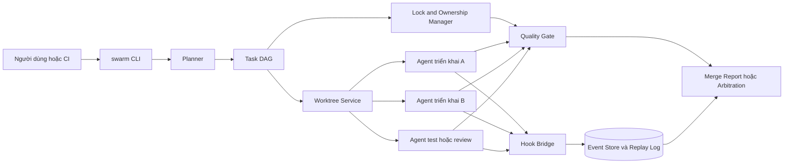
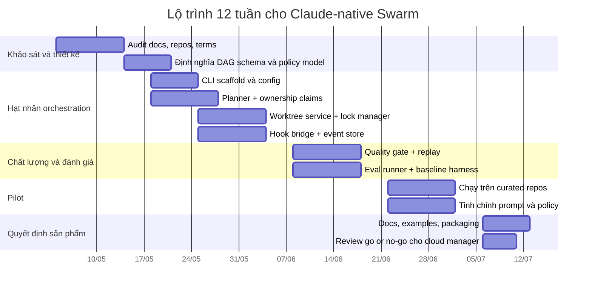

# Thiết kế một dự án Swarm mới cho Claude Code

## Tóm tắt điều hành

Tính đến ngày 29/04/2026, ý tưởng “swarm cho Claude Code” **không còn là một vùng trắng tuyệt đối**. Anthropic hiện đã có các primitive chính thức như **custom subagents**, **agent teams** ở trạng thái experimental, **hooks** trên toàn bộ vòng đời agent, **worktree isolation** cho session và subagent, **Agent SDK** bằng TypeScript/Python, cùng trải nghiệm desktop có **parallel sessions với Git isolation** và môi trường local, remote, SSH. Song song, GitHub đã xuất hiện nhiều dự án cộng đồng như `affaan-m/claude-swarm`, `TYLANDER/claude-swarm`, `am-will/swarms`, `mbruhler/claude-orchestration`, `baryhuang/claude-code-by-agents`, `wshobson/agents`, `who10086/claudia-global`, và các add-on như `major7apps/pensyve`. Vì vậy, nếu chỉ xây thêm một “launcher nhiều agent” hoặc “template skill pack”, mức độ mới sẽ thấp. citeturn8view0turn8view1turn8view3turn8view4turn24view0turn19view0turn6view0turn6view1turn6view2turn6view3turn6view5turn6view7turn6view4turn23search2

Khoảng trống thực sự vẫn còn rất rõ: **agent teams chính thức còn experimental** và Anthropic nói rõ có hạn chế về **session resumption, task coordination, shutdown behavior**; docs cũng nói agent teams **tốn token hơn**, phù hợp nhất khi các teammate độc lập, còn với **same-file edits** hoặc phụ thuộc dày đặc thì một session đơn hoặc subagents thường hiệu quả hơn. Subagents lại chỉ thích hợp cho nhiệm vụ cô lập ngữ cảnh và trả summary; khi cần nhiều agent trao đổi với nhau, phải chuyển sang agent teams. Nói cách khác, Claude Code đã có primitive, nhưng chưa có một “control plane” hoàn chỉnh cho **task graph bền vững, conflict semantics, governance, memory, eval, replay, và policy enforcement** ở cấp sản phẩm. citeturn8view0turn9view2turn9view3turn8view5turn18search8

Khuyến nghị chiến lược là **nên xây một dự án swarm mới**, nhưng **không nên** đặt nó như “một Claude Swarm nữa”. Thay vào đó, dự án nên định vị là **Claude-native swarm control plane**: một lớp điều phối nằm trên subagents / agent teams / hooks / worktrees / Agent SDK, với trọng tâm ở **dependency-aware planning**, **intent + ownership cho file/symbol**, **quality gates**, **replay + audit**, **chi phí/latency scheduling**, và **evaluation harness**. Trong ba hướng kiến trúc khả thi, hướng có tỷ lệ **novelty / effort** tốt nhất là **orchestrator middleware local-first**, đóng gói thành CLI + `.claude/` templates cho đội ngũ kỹ thuật; sau đó mới tiến hóa thành control plane cloud nếu có tín hiệu sản phẩm rõ. citeturn8view4turn17view0turn17view1turn17view2turn17view3turn17view4turn31view3turn16view0turn31view0turn32view0

Một lưu ý rất quan trọng về IP và go-to-market: nếu sản phẩm dựa vào dịch vụ Anthropic, thì **Consumer Terms** cấm phát triển sản phẩm cạnh tranh và còn cấm truy cập dịch vụ bằng phương thức automated/non-human trừ khi dùng API hoặc được phép rõ ràng; **Commercial Terms** cũng cấm xây sản phẩm/dịch vụ cạnh tranh và **resell** dịch vụ nếu không được chấp thuận. Vì vậy, đường đi an toàn hơn là xây **lớp orchestration bổ trợ** cho Claude Code / Anthropic API, tránh positioning như “hosted Claude Code clone”, và cần có review pháp lý sớm nếu đi theo mô hình thương mại. citeturn27view0turn28view1turn28view2

## Bài toán và khoảng trống của Claude Code hiện tại

Claude Code hiện đã có một hệ primitive rất mạnh, nhưng các primitive này được phân tán qua nhiều lớp: `CLAUDE.md`, skills, MCP, subagents, agent teams, hooks, plugins, settings, worktrees, desktop sessions và Agent SDK. Điều này rất linh hoạt, nhưng đồng nghĩa với việc nhóm phát triển phải **tự ghép** những mảnh rời này thành một hệ swarm có tính bền vững, quan sát được, và an toàn ở mức sản phẩm. citeturn8view2turn8view5turn8view4turn8view3

| Năng lực gốc trong Claude Code | Hiện trạng chính thức | Khoảng trống nếu mục tiêu là một sản phẩm swarm hoàn chỉnh | Nguồn |
|---|---|---|---|
| Custom subagents | Có thể tạo subagents trong `.claude/agents/`, mỗi agent có context riêng, tool access riêng, quyền độc lập | Chưa phải mạng agent peer-to-peer; subagent chủ yếu chạy tác vụ phụ và trả summary | citeturn8view1turn9view3 |
| Agent teams | Có shared tasks, inter-agent messaging, centralized management | Experimental; có hạn chế về resume, coordination, shutdown; tốn token; không phù hợp same-file edits | citeturn8view0turn9view2 |
| Hooks | Có event hooks cho SubagentStart/Stop, TaskCreated/Completed, TeammateIdle, WorktreeCreate/Remove, v.v. | Primitive rất mạnh, nhưng cần tự xây daemon/policy/eval/audit ở ngoài | citeturn8view3turn17view0turn17view1turn17view2turn17view3turn17view4turn9view0turn9view1 |
| Worktree isolation | Claude CLI hỗ trợ `--worktree`; subagents có thể dùng `isolation: worktree`; desktop parallel sessions cũng dùng Git isolation | Có isolation, nhưng chưa có first-class protocol cho task ownership, lock semantics, merge arbitration ở cấp swarm | citeturn24view0turn19view0 |
| Desktop parallel sessions | Desktop cho phép nhiều session song song, local/remote/SSH, background tasks, preview, PR monitoring | Đây là session parallelism tốt, nhưng vẫn chưa tương đương một orchestration layer có task graph, evaluation, audit, governance | citeturn19view0 |
| Permissions và deny rules | Có thể chặn truy cập `.env`, secrets, credentials qua `permissions.deny` | Least-privilege khả dụng nhưng chủ yếu là cấu hình thủ công; thiếu policy compiler theo task/agent/tenant | citeturn9view5turn8view6 |
| Agent SDK | Có SDK TypeScript/Python với tools, agent loop, context management | Official SDK là primitive lập trình, không phải control plane hoàn chỉnh | citeturn8view4turn18search4 |

Điểm mấu chốt là **Claude Code đã cung cấp đủ “atoms”, nhưng chưa cung cấp “operating system” cho swarm**. Anthropic thậm chí đã mở sẵn những event rất phù hợp cho một control plane bên ngoài: `TaskCreated` có thể dùng để ép naming convention hoặc validate task description; `TaskCompleted` có thể chặn close nếu test/lint chưa pass; `TeammateIdle` có thể biến thành quality gate trước khi teammate rời vòng lặp; `SubagentStart` và `SubagentStop` cho phép inject context, lấy transcript path, lấy last assistant message; `WorktreeCreate/Remove` cho phép tùy biến cả lifecycle của workspace cô lập. Nhưng tất cả những khả năng đó mới là “đầu nối”, chưa phải sản phẩm. citeturn17view0turn17view1turn17view2turn17view3turn17view4turn9view0turn9view1

Vì vậy, bài toán sản phẩm không phải là “làm sao spawn nhiều agent hơn”, mà là **làm sao biến các primitive có sẵn thành một hệ điều phối có tính quyết định**: task graph nào được sinh ra, ai được sửa file nào, khi nào cần worktree riêng, thế nào là “done”, khi nào escalate cho người, và làm sao replay / audit / benchmark được toàn bộ hệ thống đó. Các dự án cộng đồng hiện nay chạm vào từng phần của bài toán này, nhưng chưa có một implementation Claude-native nào bao được toàn bộ vòng đời. citeturn6view0turn6view2turn6view3turn6view5turn6view6turn6view7

## Khảo sát tài liệu và hệ sinh thái

### Tài liệu chính thức và ngụ ý thiết kế

Anthropic đang đi theo hướng **mở primitive thay vì đóng khung workflow**. Tài liệu “Extend Claude Code” mô tả rõ cách `CLAUDE.md`, skills, MCP, subagents, agent teams, hooks, và plugins cắm vào các phần khác nhau của vòng agentic loop. Điều này xác nhận rằng một sản phẩm swarm tốt nên **dựa vào bề mặt mở của Claude Code**, không tái phát minh agent loop từ đầu. citeturn8view5

Tài liệu agent teams nhấn mạnh rằng team lead điều phối, teammates giao tiếp trực tiếp với nhau, nhưng lại cảnh báo rõ về chi phí token, overhead điều phối, và hạn chế ở same-file edits. Đây là tín hiệu rất mạnh rằng **Claude-native swarm cần một lớp phân ranh giới công việc tốt hơn agent teams mặc định**. Nếu không có dependency-aware decomposition và ownership rõ ràng, swarm sẽ nhanh chóng biến thành “nhiều context windows cùng sửa repo” thay vì thật sự tăng throughput. citeturn8view0turn9view2

Tài liệu worktrees rất đáng chú ý. Anthropic đã làm phần khó nhất của isolation ở mức developer experience: `--worktree`, `.worktreeinclude`, subagent worktrees, cleanup lifecycle, và khả năng override qua hook cho non-git VCS. Điều này có nghĩa là một sản phẩm swarm mới **không nên bán “worktree” như USP chính**, mà nên bán **policy trên worktree**: ownership, lock semantics, merge protocol, retry, rollback, audit, và scheduling. citeturn24view0turn9view0turn9view1

### Hệ Claude-native trên GitHub

Bảng dưới đây chỉ tổng hợp **những gì được mô tả công khai trong README/docs/repo page** tại thời điểm crawl; ô “giới hạn” là đánh giá dựa trên public scope chứ không phải audit toàn bộ codebase.

| Tên | Repo | Tính năng nổi bật | Giới hạn hoặc góc còn thiếu | License | Nguồn |
|---|---|---|---|---|---|
| Claude Swarm | `affaan-m/claude-swarm` | Dependency-aware scheduling, pessimistic file locking, budget enforcement, Opus quality gate, TUI, session replay, YAML topology | Sinh ra từ hackathon; thiên về local CLI/TUI; public docs không cho thấy multi-user governance hay SaaS control plane | MIT | citeturn6view0turn14view0turn11view0 |
| Claude Swarm | `TYLANDER/claude-swarm` | Cloud orchestration, CLI/API submit task, isolated git worktrees, merge back, cost controls; monorepo Node/TS + Azure + Terraform | Early-stage public artifact; no releases published tại thời điểm crawl; phạm vi nghiêng về infrastructure skeleton hơn là ecosystem/product maturity | MIT | citeturn6view1turn21view1 |
| Swarms | `am-will/swarms` | Planner tạo plan có explicit dependencies, chạy theo “waves”, reviewer subagent, beginner-friendly skill pack cho Claude Code/Codex | Dựa trên skill/subagent pattern; không phải durable orchestration service độc lập; no releases published tại thời điểm crawl | MIT | citeturn6view2turn11view6turn21view0turn14view4 |
| Orchestration Plugin for Claude Code | `mbruhler/claude-orchestration` | Workflow DSL kiểu N8N, sequential/parallel/conditional flow, temp scripts Python/Node.js, templates, scheduling, registry | Rất rộng cho workflow automation nói chung; không nhấn mạnh repo-native conflict semantics hay code-review control plane chuyên biệt | MIT | citeturn6view3turn14view5turn22view0turn22view1turn22view2 |
| Claude Code Agentrooms UI + Remote API | `baryhuang/claude-code-by-agents` | Desktop app + API, @mentions, local + remote agents, task decomposition, file-based communication, dùng Claude subscription auth | Public README nói rõ bản hiện tại chỉ hỗ trợ **one agent room**; desktop app cần backend riêng chạy tách biệt | MIT | citeturn21view2turn11view8turn14view7 |
| Claude Code Plugins: Orchestration and Automation | `wshobson/agents` | 184 agents, 16 workflow orchestrators, plugin-based composition, team presets, PluginEval chất lượng plugin/skill | Đây là ecosystem plugin rất mạnh, nhưng không phải một swarm control plane duy nhất với shared state / branch arbitration / hosted fleet | MIT | citeturn6view7turn14view6turn11view10 |
| Claude.Orchestrator | `claudecodecodexforge/Claude.Orchestrator` | Shared context JSON store, workflow state persistence, resume, rollback, performance analytics | Sát với “control plane” hơn các repo khác nhưng public footprint còn sớm; no releases published tại thời điểm crawl; hệ sinh thái .NET niche hơn cho cộng đồng Claude Code | MIT | citeturn6view6turn11view9turn22view3turn22view4 |
| Claudia Global | `who10086/claudia-global` | GUI/toolkit cho Claude Code, custom agents, interactive sessions, secure background agents, process isolation, per-agent file/network permissions, local-only storage, no telemetry | Tập trung mạnh vào desktop UX và secure background execution hơn là dependency graph / repo merge protocol | AGPL-3.0 | citeturn6view4turn33view0turn33view2 |
| Pensyve | `major7apps/pensyve` | Cross-session memory cho Claude Code, Rust + SQLite + embeddings, MCP integration, hooks/skills/commands/plugin | Giải quyết rất tốt memory layer, nhưng không phải một orchestrator cho multi-agent coding | Apache-2.0 | citeturn23search0turn23search2turn23search6 |

Kết luận từ bảng trên là: **có nhiều “partial products”, chưa có “whole product”**. Có dự án mạnh về TUI và file lock; có dự án mạnh về cloud workers và worktrees; có dự án mạnh về workflow DSL; có UI desktop; có plugin ecosystem; có memory runtime. Nhưng chưa thấy một implementation Claude-native công khai nào kết hợp đầy đủ: **typed task graph + conflict semantics + persistent state + replay + eval + governance + enterprise policy** trong một hệ đồng nhất. citeturn6view0turn6view1turn6view3turn6view5turn6view6turn6view7turn23search2

### Framework tổng quát và literature survey

Ở bình diện framework chung, thị trường đã chứng minh nhu cầu orchestration là có thật. `AutoGen` từng mở đường cho message passing, event-driven agents và local/distributed runtime, nhưng hiện repo ở **maintenance mode** và chính Microsoft khuyến nghị người dùng mới chuyển sang Microsoft Agent Framework. `CrewAI` phát triển trên mô hình **Crews** và **Flows**, trong đó Flows là event-driven workflow với state management; `LangGraph` nhấn mạnh **durable execution** và **human-in-the-loop**; `langgraph-swarm-py` đưa ra pattern swarm với **dynamic handoff**, checkpointer và memory; `MetaGPT` mã hóa **SOP** của một “software company”; còn `OpenHands` đã đi xa hơn sang CLI, local GUI, cloud, enterprise, multi-user support, RBAC, collaboration và evaluation harness. Tuy nhiên, hầu hết các framework này đều **model-agnostic** hoặc **agent-framework-first**, chứ không **Claude-Code-native-first**. citeturn7view0turn12view6turn12view7turn7view1turn12view0turn12view1turn7view2turn12view2turn15view0turn20view2turn7view4turn12view4turn7view5turn12view5turn20view3

Về học thuật, các paper khá nhất quán ở một số điểm. `CAMEL` đề xuất role-playing để thúc đẩy hợp tác tự trị; `MetaGPT` cho rằng SOP giúp giảm logic inconsistency và cascading hallucination; `ChatDev` cho thấy role-specialized agents có thể tham gia xuyên suốt thiết kế, code, test, document trong một pipeline phát triển phần mềm. Điểm chung của ba hướng này là: **phân vai thôi chưa đủ, workflow phải có cấu trúc**. citeturn3search2turn3search1turn3search3

`AgentCoord` đi xa hơn khi chỉ ra rằng điều phối bằng ngôn ngữ tự nhiên là mơ hồ, và vì thế cần một **structured representation** cho coordination strategy. `MultiAgentBench` cho thấy benchmark nên đo cả task completion lẫn chất lượng collaboration, đồng thời báo cáo rằng **graph topology** hoạt động tốt nhất trong scenario nghiên cứu và **cognitive planning** cải thiện milestone achievement rate thêm 3%. `AgentsNet` lại cho thấy nhiều frontier models làm tốt ở **small networks** nhưng giảm mạnh khi số agent tăng, lên tới thí nghiệm 100 agents. Từ góc nhìn sản phẩm, điều này nói rằng một swarm tốt **không nên scale agent count vô tội vạ**; thay vào đó cần topology rõ, planning tốt, và giới hạn fan-out hợp lý. citeturn32view3turn32view4turn31view0turn32view0turn32view1

`AFlow` đặc biệt quan trọng cho roadmap dài hạn vì nó coi workflow optimization là bài toán tìm kiếm trên **code-represented workflows**, và báo cáo cải thiện trung bình 5.7% trên sáu benchmark reasoning so với baseline SOTA. Điều này mở ra hướng phát triển sau MVP: không chỉ thực thi swarm, mà còn **tự tối ưu swarm policy** từ telemetry. Một paper mới hơn là `MPAC` còn đánh thẳng vào đúng pain point của coding swarms: MCP và A2A giả định một principal duy nhất; khi nhiều agent độc lập thao tác trên shared state như cùng sửa một repo, coordination dễ sụp xuống manual merge hoặc overwrite. `MPAC` đề xuất intent declaration, conflict objects, governance layer, causal watermarking và optimistic concurrency; đây là gợi ý rất mạnh cho semantic lock manager của một Claude-native swarm. citeturn31view3turn16view0

## Nhu cầu chưa được đáp ứng và không gian cơ hội

Khoảng trống quan trọng nhất là **durable task graph**. Anthropic có task hooks và agent teams, nhưng public docs không mô tả một first-class task graph bền vững có state machine, resume semantics, typed dependencies, rollback, ownership, và cross-run memory. Một vài repo cộng đồng chạm vào planning có dependency (`am-will/swarms`) hoặc persistent workflow state (`Claude.Orchestrator`), nhưng chưa thấy một implementation Claude-native phổ biến nào nối trọn planning → execution → policy → replay → evaluation. citeturn17view0turn17view1turn6view2turn22view4

Khoảng trống tiếp theo là **conflict semantics cao hơn file lock**. `affaan-m/claude-swarm` đã có pessimistic file locking, và Claude Code có worktree isolation rất tốt. Nhưng docs chính thức vẫn cảnh báo same-file edits dẫn đến overwrite; đó là dấu hiệu cho thấy file-level isolation thôi chưa đủ. Cái thị trường còn thiếu là **intent-aware ownership**: agent nào “own” file, symbol, migration, test, hoặc API contract nào; khi hai agent đụng cùng vùng, hệ phải biết block, split, merge, hoặc escalate dựa trên policy chứ không chỉ dựa trên path. citeturn14view0turn9view2turn24view0turn16view0

Khoảng trống thứ ba là **governance và policy compiler**. Claude Code có `permissions.deny`, hook lifecycle, per-agent tool access, process isolation ở một số công cụ GUI, nhưng quyền hiện tại còn phân tán theo settings/hook/plugin. Thị trường chưa có một sản phẩm Claude-native phổ biến nào cho phép viết policy kiểu: “security-reviewer chỉ được read + bash test”, “schema migrations phải qua quality gate”, “mọi task chạm `auth/` phải có reviewer riêng”, “mọi prompt có file secrets bị deny tự động”. Phần này đặc biệt giá trị với đội ngũ enterprise. citeturn9view5turn8view6turn33view0

Khoảng trống thứ tư là **memory đúng ngữ cảnh cho swarm**, không chỉ cho một agent. `Pensyve` giải được cross-session memory rất hay, nhưng memory ở cấp sản phẩm swarm còn cần gắn với **task DAG, PR, branch, repo snapshot, agent role, và failure mode**. Nói cách khác, sản phẩm còn thiếu “operational memory” chứ không chỉ “semantic memory”. Repo memory nên nhớ rằng lần trước task `oauth-migration` fail vì secret env không copy vào worktree; và khi phát hiện tương tự, planner phải đổi policy ngay từ đầu. Public ecosystem hiện có tín hiệu cho memory runtime, nhưng chưa thấy memory engine nào bọc trọn multi-agent coding orchestration theo cách Claude-native. citeturn23search0turn23search2turn24view0

Khoảng trống thứ năm là **evaluation harness chuyên cho swarm orchestration**. `wshobson/agents` có `PluginEval`; `OpenHands` có hẳn benchmark infrastructure; SWE-bench và Multi-SWE-bench cung cấp ground truth cho issue resolution. Nhưng thị trường chưa có một harness phổ biến để đo riêng các chỉ số của swarm Claude-native như: coordination overhead, stale-lock rate, arbitration frequency, cross-agent contradiction rate, replay completeness, cost per resolved issue, quality-gate save rate, hay wall-clock speedup so với single-agent baseline. Đây là khoảng trống rất “productizable” vì một swarm không đo được thì khó chứng minh giá trị. citeturn14view6turn29view0turn30view0turn30view1turn30view2

Khoảng trống cuối cùng là **multi-user / multi-principal collaboration**. Khi swarm chuyển từ “một người dùng local” sang “engineer + reviewer + PM + CI + security agent + cloud worker”, bài toán không còn là multi-agent thuần nữa mà là **multi-principal shared-state coordination**. `MPAC` mới chỉ ra rất rõ rằng đây là vùng nghiên cứu còn mở. Một hosted swarm manager có governance, arbitration, audit, και policy inheritance có thể tạo ra moat tốt hơn hẳn một local plugin. citeturn16view0

## Các concept sản phẩm đề xuất

### So sánh nhanh ba concept

| Concept | Mô tả | Time-to-market | Mức mới | Độ khó | Moat tiềm năng | Khuyến nghị |
|---|---|---:|---:|---:|---:|---|
| Lightweight template và CLI kit | Bộ `swarm init`, templates `.claude/agents/`, commands, hooks, `swarm.yaml`, local runner đơn giản | Nhanh nhất | Thấp đến trung bình | Thấp | Thấp đến trung bình | Tốt để thăm dò adoption sớm |
| Orchestrator middleware | Local-first daemon/CLI quản lý task graph, worktrees, locks, replay, quality gate, eval | Trung bình | Cao nhất theo effort bỏ ra | Trung bình | Cao | **Nên chọn làm MVP khuyến nghị** |
| Cloud-hosted swarm manager | Hosted control plane, worker fleet, RBAC, policy, audit, multi-repo, dashboards | Chậm nhất | Cao | Cao | Rất cao | Chỉ nên làm sau khi middleware chứng minh PMF |

Bảng trên phản ánh một thực tế: concept đầu tiên sẽ nhanh, nhưng dễ bị chìm vào nhóm các plugin/template đã có; concept cuối cùng có moat tốt nhất nhưng đội ngũ sẽ phải giải quá nhiều bài toán hạ tầng, bảo mật, tenancy và pháp lý ngay từ đầu. Concept giữa là điểm cân bằng đẹp nhất. Nhận định này phù hợp với bức tranh thị trường hiện tại: ecosystem đã có nhiều plugin/skill/UI rời, nhưng còn thiếu một orchestration core có shared state, conflict policy và eval discipline. citeturn6view2turn6view3turn6view5turn6view6turn6view7turn23search2

### Lightweight template và CLI kit

Đây là concept nhỏ nhất: tạo một tool `swarm` có nhiệm vụ sinh project scaffold trong `.claude/`, sinh subagents theo role, tạo command templates, setup hooks, và đọc `swarm.yaml` để điều phối ở mức local. Về kỹ thuật, concept này tận dụng rất nhiều primitive chính thức: `.claude/agents/` để định nghĩa agent, `settings.json` cho permission/hook, subagent worktrees khi cần isolation, và hook events để ghi log/replay. citeturn8view2turn8view6turn24view0turn17view3turn17view4

**Components** nên gồm CLI generator, plan parser, local task scheduler, YAML config loader, hook bridge viết file JSONL, và report renderer. **Data flow** đơn giản: user chạy `swarm init` → scaffold file → user chạy `swarm plan "..."` → planner agent tạo DAG → `swarm run` spawn các subagent/worktree theo wave → quality gate → report. **API** ở đây chủ yếu là CLI và local JSON contracts. **Conflict policy** có thể bắt đầu bằng file ownership tĩnh từ planner. **Security model** dựa trên least-privilege tools và `permissions.deny`. **Persistence** đủ với SQLite hoặc JSONL. **Testing** nên dùng fixture repos nhỏ và golden snapshots của plan/output. citeturn9view5turn17view1turn24view0

Điểm yếu của concept này là khó tạo moat nếu chỉ dừng ở “mẫu file + wrapper”. `am-will/swarms`, `mbruhler/claude-orchestration`, `wshobson/agents`, thậm chí chính Anthropic với skills/plugins đã đi khá xa ở khu vực này. Kit chỉ nên là **cửa vào**, không nên là cả sản phẩm. citeturn6view2turn6view3turn6view7turn8view5

### Orchestrator middleware

Đây là concept đáng làm nhất. Ý tưởng là tạo một tiến trình local-first, tạm gọi là `swarmd`, đứng giữa Claude Code primitives và repo để quản lý **task graph, worktrees, lock semantics, quality gates, event store, replay, và evaluation**. Nó không thay Claude Code; nó làm vai trò **control plane** ở trên Claude Code. Concept này khớp rất tự nhiên với Agent SDK, hook lifecycle, task hooks, worktree hooks, và subagent/team model của Anthropic. citeturn8view4turn8view3turn17view0turn17view1turn17view2turn9view0turn9view1



Flow trên phản ánh đúng cơ hội khác biệt: planner không chỉ sinh task, mà phải sinh cả **ownership intent**; worktree service không chỉ tách nhánh, mà phải gắn worktree với task; hook bridge không chỉ log, mà biến `TaskCreated`, `TaskCompleted`, `TeammateIdle`, `SubagentStop` thành tín hiệu orchestration; quality gate không chỉ review, mà còn là cổng quyết định merge/rollback/escalate. Các hook mà Claude Code đã expose khiến mô hình này khả thi mà không cần reverse-engineer agent loop. citeturn17view0turn17view1turn17view2turn17view3turn17view4turn9view0turn9view1

**Components** nên gồm:

| Component | Vai trò |
|---|---|
| Planner | Biến goal thành task graph có `depends_on`, `owned_files`, `owned_symbols`, `acceptance_checks`, `risk_level` |
| Dispatcher | Chạy task theo wave hoặc theo sẵn sàng trong DAG |
| Lock and Ownership Manager | Chặn same-file/same-symbol contention; xử lý stale locks và arbitration |
| Worktree Service | Tạo worktree, copy gitignored secrets an toàn nếu policy cho phép, cleanup |
| Worker Runner | Gọi Claude Code subagents hoặc Agent SDK worker |
| Hook Bridge | Nhận event từ Subagent/Task/Team/Worktree lifecycle, chuẩn hóa thành event nội bộ |
| Quality Gate | Review kết quả hợp nhất; chạy tests/lint/security prompts |
| Replay Store | JSONL + normalized DB record để phát lại và audit |
| Eval Runner | Chạy batch benchmark, baseline, cost/speed analysis |

**Data flow** nên là event-sourced. Mọi thay đổi lớn đều thành event: `PlanCreated`, `TaskClaimed`, `WorktreeOpened`, `AgentStarted`, `PatchProposed`, `TaskValidated`, `GateFailed`, `ArbitrationRequested`, `RunReplayExported`. Điều này giúp resume tốt hơn so với nhiều “bash loops” đơn giản và cũng tạo dữ liệu cho optimization tương lai theo hướng AFlow. citeturn6view2turn31view3

**API** nên vừa có CLI vừa có local HTTP/IPC:
- `POST /runs`
- `POST /runs/:id/plan`
- `POST /runs/:id/execute`
- `POST /tasks/:id/claim`
- `POST /tasks/:id/complete`
- `POST /tasks/:id/arbitrate`
- `GET /runs/:id/replay`
- `POST /evals`

**Conflict policy** là phần khác biệt nhất. Tôi khuyến nghị ba lớp:
- **Intent claim**: planner phải gán `owned_files`, `owned_symbols`, `acceptance_checks`.
- **Execution lock**: worker chỉ bắt đầu nếu ownership claim không đụng task đang chạy.
- **Validation gate**: nếu patch thực tế chạm ngoài phạm vi đã claim, task bị downgrade thành “needs arbitration”.

Cách làm này học từ file locks của repo cộng đồng, từ warning same-file edits trong docs, và từ quan điểm conflict-first của MPAC. citeturn14view0turn9view2turn16view0

**Security model** nên bám Claude Code least-privilege và enterprise hygiene: deny `.env`, `secrets/**`, creds; worker mặc định làm việc trong worktree; chỉ quality gate hoặc merger mới được chạm main worktree; secret scanning trước merge; prompt injection shielding cho mọi transcript và log. Anthropic đã có `permissions.deny` và worktree hooks, nên tầng security của bạn sẽ là **policy compiler + enforcement**, không cần tự phát minh sandbox từ đầu. citeturn9view5turn9view0turn24view0

**Persistence** nên khởi đầu với SQLite local cho `runs`, `tasks`, `claims`, `events`, `artifacts`, `costs`; transcript và replay lưu JSONL. **Testing strategy** nên có bốn lớp: unit test cho scheduler/locks; integration test với fixture repos; chaos tests cho interrupted run / stale lock / failed gate; benchmark tests trên SWE-bench subsets và repo thực. citeturn30view0turn30view1turn30view2turn29view0

### Cloud-hosted swarm manager

Concept cloud là phiên bản enterprise hoá của middleware. Nó phù hợp khi mục tiêu là **nhiều repo, nhiều kỹ sư, nhiều team, worker fleet, RBAC, audit retention, dashboards, budget governance**, và có thể cả CI/CD integration. Về mặt “surface”, Anthropic đã có remote/cloud sessions trong desktop và một số dự án cộng đồng đã thử cloud worker + Azure/Terraform; vì vậy उत्पाद này chỉ đáng làm nếu nó giải quyết được **quản trị ở cấp tổ chức**, không phải chỉ “chạy agent trên server”. citeturn19view0turn21view1turn7view5

**Components** nên gồm control plane API, tenant-aware Postgres, queue, worker containers, repo mirror/cache, object store cho replay/logs, policy service, auth/RBAC, billing/cost service, observability, và web console. **Data flow** là: user/CI tạo run → planner ở control plane sinh DAG → queue phát task cho workers → mỗi worker mount repo mirror hoặc ephemeral clone/worktree → task outputs quay về quality gate → merge tạo PR/branch report → artifacts và telemetry lưu về control plane.

**Conflict policy** ở cloud nên chuyển từ “file lock local” sang “intent objects + branch-per-task + arbitration queue”. **Security model** phải multi-tenant: encryption at rest, per-tenant secrets broker, ephemeral credentials, transcript redaction, retention policy. **Persistence**: Postgres + object storage + Redis/BullMQ hoặc message bus. **Testing**: ngoài local harness, cần tenancy isolation tests, billing correctness tests, chaos tests cho worker eviction, branch drift, and dead-letter queues.

Concept này có moat mạnh nhất nhưng đối mặt với rủi ro lớn nhất: pháp lý với Anthropic terms, độ phức tạp hạ tầng, và cạnh tranh trực tiếp hơn với các sản phẩm kiểu OpenHands Cloud / Claude Desktop remote sessions. Tôi chỉ khuyến nghị đi theo hướng này **sau khi** middleware local-first chứng minh được rằng conflict-aware orchestration thật sự tạo uplift có thể đo được. citeturn27view0turn28view1turn19view0turn12view5

## Đặc tả MVP và kế hoạch thực nghiệm

### MVP khuyến nghị

MVP nên là **Concept B nhưng đóng gói theo trải nghiệm Concept A**: người dùng tương tác bằng CLI và file `.claude/`, nhưng dưới nền có một `swarmd` local daemon để quản lý DAG, worktree, lock, replay và quality gate. Cách đóng gói này vừa tận dụng thói quen Claude Code của developer, vừa tạo khác biệt rõ so với các template/plugin hiện có. citeturn8view2turn8view6turn24view0turn6view2turn6view3

**Tập lệnh CLI đề xuất**

| Lệnh | Mục đích |
|---|---|
| `swarm init` | Tạo `.claude/agents/`, `.claude/commands/`, `swarm.yaml`, `.worktreeinclude`, policy defaults |
| `swarm plan "<goal>"` | Sinh task graph và ownership claims |
| `swarm run` | Chạy DAG, spawn worktrees, dispatch workers |
| `swarm status` | Xem state machine, locks, budget, pending arbitration |
| `swarm resume <run-id>` | Tiếp tục run bị gián đoạn |
| `swarm replay <run-id>` | Phát lại event timeline |
| `swarm eval <suite>` | Chạy benchmark suite |
| `swarm doctor` | Kiểm tra config, permissions, hook wiring, git worktree health |

**File templates đề xuất**

```text
.claude/
  agents/
    swarm-architect.md
    swarm-implementer.md
    swarm-quality-gate.md
    swarm-security-reviewer.md
  commands/
    swarm-plan.md
    swarm-run.md
  settings.json
.worktreeinclude
swarm.yaml
.swarm/
  runs/
  replay/
  cache/
```

Claude Code chính thức đọc subagents từ `.claude/agents/` và settings từ `.claude/settings.json`; worktrees đi qua `.claude/worktrees/` và có thể dùng `.worktreeinclude` cho gitignored local config. citeturn8view2turn8view6turn24view0

### Mẫu `.claude/agents/` và prompt mẫu

Dưới đây là **template đề xuất** cho MVP. Đây là mẫu sản phẩm, không phải trích nguyên văn từ tài liệu; chúng được xây trên các bề mặt chính thức mà Anthropic mô tả cho custom subagents, hooks và worktree isolation. citeturn8view1turn9view4turn24view0

```md
---
name: swarm-architect
description: Phân rã yêu cầu thành task graph có dependency, ownership và acceptance criteria.
tools: [Read, Grep, Glob]
---

Bạn là kiến trúc sư điều phối cho một swarm code agent.

Nhiệm vụ:
- Đọc codebase vừa đủ để hiểu biên giới module.
- Tách mục tiêu thành các task nhỏ, độc lập tối đa, có thứ tự dependency rõ ràng.
- Với mỗi task, bắt buộc xuất:
  - id
  - summary
  - depends_on
  - owned_files
  - owned_symbols
  - acceptance_checks
  - risk_level
- Tránh tạo hai task cùng sở hữu một file nếu không thật sự cần.
- Nếu phát hiện cùng một file phải được sửa bởi nhiều task, đề xuất:
  - tách theo symbol
  - hoặc chuyển thành task tuần tự
  - hoặc yêu cầu arbitration
- Không viết code. Chỉ lập kế hoạch.
```

```md
---
name: swarm-implementer
description: Thực thi một task đã được claim và chỉ được sửa trong ownership boundary đã chỉ định.
tools: [Read, Edit, Write, Bash, Grep, Glob]
isolation: worktree
---

Bạn là worker triển khai trong swarm.

Luật bắt buộc:
- Chỉ làm đúng task được giao.
- Chỉ sửa file/symbol nằm trong ownership boundary.
- Nếu phải chạm file ngoài boundary, dừng lại và báo NEEDS_ARBITRATION.
- Sau mỗi thay đổi:
  - chạy test/lint tối thiểu liên quan
  - ghi lại files_touched
  - ghi lại decision_log ngắn gọn
- Không tự merge với task khác.
- Ưu tiên patch nhỏ, có thể review.
```

```md
---
name: swarm-quality-gate
description: Đánh giá output của nhiều worker, phát hiện mâu thuẫn, thiếu test và lệch yêu cầu.
tools: [Read, Bash, Grep, Glob]
---

Bạn là quality gate cuối.

Checklist:
- Acceptance checks của từng task đã pass chưa?
- Có file nào bị sửa ngoài ownership claim không?
- Có mâu thuẫn API / type / migration giữa các task không?
- Test, lint, typecheck, security scan có pass không?
- Kết luận cuối cùng phải là một trong:
  - APPROVE
  - REQUEST_FIXES
  - REQUIRE_ARBITRATION
```

**`swarm.yaml` mẫu**

```yaml
version: 0.1
goal: "Add OAuth2 login and session refresh support"
parallelism: 4
budget_usd: 12
planner: swarm-architect
worker: swarm-implementer
quality_gate: swarm-quality-gate

policies:
  same_file: block
  same_symbol: ask
  out_of_scope_edit: fail
  tests_required: true
  security_scan_required: true

routing:
  plan_model: strong
  worker_model: fast
  gate_model: strong
```

**`.claude/settings.json` mẫu tối thiểu**

```json
{
  "permissions": {
    "deny": [
      "Read(./.env)",
      "Read(./.env.*)",
      "Read(./secrets/**)",
      "Read(./config/credentials.json)"
    ]
  }
}
```

Anthropic chính thức khuyến nghị dùng `permissions.deny` để chặn `.env`, secrets và credentials, và đây nên là default ngay từ `swarm init`. citeturn9view5

**Prompt mẫu cho user**

```text
/swarm-plan
Mục tiêu: thêm OAuth2 cho frontend và backend.
Ràng buộc:
- Không sửa database schema nếu không thật cần.
- Có test cho refresh token flow.
- Tách riêng task backend, frontend, test, review.
```

```text
/swarm-run
Chạy plan đã tạo với parallelism 4.
Nếu có đụng cùng file hoặc cùng symbol, dừng task thứ hai và yêu cầu arbitration.
```

```text
/swarm-review
Tổng hợp kết quả, chạy quality gate, và xuất:
- task nào pass
- task nào fail
- file nào bị chạm ngoài boundary
- khuyến nghị merge strategy
```

### Backlog MVP và ước lượng

| Hạng mục | Mô tả | Ước lượng |
|---|---|---:|
| CLI scaffold | `swarm init`, file generator, config validation | 4–6 ngày |
| Planner + DAG schema | Task graph, ownership claims, YAML/JSON contracts | 6–8 ngày |
| Worktree service | Create/remove/copy-includes/cleanup | 4–6 ngày |
| Lock manager | File/symbol claim, stale-lock, arbitration triggers | 6–8 ngày |
| Worker runner | Claude Agent SDK wrapper + subagent bridge | 6–8 ngày |
| Hook bridge | Event normalization từ Subagent/Task/Worktree lifecycle | 5–7 ngày |
| Quality gate | Test/lint/type/security integration + prompt review | 5–7 ngày |
| Replay + audit UI thô | Timeline, artifacts, cost summary | 5–7 ngày |
| Eval runner | Baseline compare, suite execution, CSV/JSON export | 6–8 ngày |
| Hardening | Documentation, examples, crash recovery, doctor command | 5–7 ngày |

Một MVP khả thi là khoảng **52–72 engineering days**. Với đội **2 kỹ sư full-time** cộng **1 PM/tech lead bán thời gian**, mốc thực tế là **6–8 tuần** để có bản pilot dùng được. Đây là ước lượng thiết kế, không phải dữ liệu bên ngoài.

### Acceptance criteria

| Tiêu chí | Mức đạt |
|---|---|
| Task graph hợp lệ | 100% task có `depends_on`, `owned_files` hoặc `owned_symbols`, `acceptance_checks` |
| Conflict handling | Không có same-file overwrite không được phát hiện |
| Resume | Run bị kill có thể resume và giữ nguyên DAG state |
| Quality gate | Mọi task đóng trạng thái “done” đều đi qua validation |
| Replay | 100% run có timeline, artifact index, summary |
| Least privilege | Default config chặn secrets phổ biến |
| Observability | Có cost, wall-clock, retries, arbitration logs ở cấp run |

### Rủi ro chính của MVP

| Rủi ro | Vì sao quan trọng | Giảm thiểu |
|---|---|---|
| Planner sinh ownership quá mơ hồ | Dẫn đến false conflicts hoặc missed conflicts | Yêu cầu planner xuất file + symbol + acceptance checks |
| Worker phá boundary | Thực tế code thường xuyên đòi hỏi đụng phụ trợ | Validation gate bắt out-of-scope edit và chuyển arbitration |
| Worktree drift | Mỗi task chạy trên snapshot khác nhau | Rebase/refresh policy theo wave; quality gate composite |
| Cost bùng nổ | Agent teams tốn token mạnh | Dùng fast model cho worker, strong model cho plan/gate; budget cap |
| Adoption friction | Dev không muốn học thêm tool | Giữ giao diện là CLI + `.claude/` quen thuộc |
| Sai positioning pháp lý | Dễ chạm Terms của Anthropic | Đi theo API/commercial path, legal review sớm |

### Kế hoạch thực nghiệm

Một swarm project tốt phải chứng minh được **uplift** so với baseline, không chỉ “trông có vẻ thông minh hơn”. Tôi khuyến nghị benchmark theo ba lớp: issue resolution, collaboration quality, và operational metrics. SWE-bench cung cấp harness reproducible bằng Docker cho issue resolution thực tế từ GitHub; SWE-bench Verified là tập 500 instance đã được human-validated; Multi-SWE-bench mở rộng sang 7 ngôn ngữ với 1,632 instance và còn có bản mini 400 instance; OpenHands có evaluation harness public; MultiAgentBench và AgentsNet đo trực tiếp chất lượng multi-agent coordination và scaling. citeturn30view0turn30view1turn30view2turn29view0turn31view0turn32view0

| Lớp benchmark | Bộ dữ liệu hoặc repo | Mục tiêu đo | Ngưỡng thành công đề xuất | Nguồn |
|---|---|---|---|---|
| Issue resolving chuẩn | SWE-bench Verified subset 50–100 tasks | % resolved, cost per resolved issue, wall-clock | +10–15% resolved hoặc -20% wall-clock so với single-agent baseline | citeturn30view1turn30view0 |
| Multilingual coding | Multi-SWE-bench mini hoặc subset full | Generalization ngoài Python | Hiệu năng không rơi quá 15% khi sang TS/JS/Go/Rust | citeturn30view2turn13search9 |
| Harness tái lập | OpenHands benchmarks | Reproducibility, logging, config discipline | 100% benchmark run reproducible từ config versioned | citeturn29view0 |
| Collaboration KPI | MultiAgentBench-inspired internal tasks | Milestone completion, contradiction rate, topology gain | Graph/DAG policy tốt hơn flat-parallel baseline | citeturn31view0 |
| Scaling topology | AgentsNet-style internal microbench | Điểm rơi khi tăng 2 → 4 → 8 agents | Tìm “sweet spot” agent count cho coding repo | citeturn32view0 |
| Safety | Internal repo fixtures với secret files và conflicting tasks | Secret leak rate, out-of-boundary edit rate, stale-lock rate | Secret leak = 0; stale-lock < 5%; out-of-scope edit phát hiện > 95% | citeturn9view5turn16view0 |

**Baseline nên có ba mức**:
- một Claude Code session đơn;
- Claude Code + subagents thủ công;
- orchestration middleware của bạn.

Nếu có điều kiện, thêm baseline “agent teams experimental” cho các task phù hợp, nhưng cần nhớ Anthropic xem đây là experimental và có overhead/limitations rõ ràng. citeturn8view0

## Lộ trình, stack khuyến nghị, cân nhắc IP và bước tiếp theo

### Lộ trình nghiên cứu và triển khai



### Stack khuyến nghị

Anthropic Agent SDK hỗ trợ cả **TypeScript** lẫn **Python**, nhưng nếu mục tiêu là một sản phẩm orchestration có CLI, daemon, local HTTP API, structured configs, web UI và typed contracts, thì **Node.js + TypeScript** là lựa chọn hợp lý nhất cho lõi sản phẩm. Điều này cũng được củng cố bởi một số dự án Claude-native mới như `TYLANDER/claude-swarm`, vốn chọn Node.js 22, TypeScript 5, shared types và Turborepo cho cloud orchestration. citeturn8view4turn21view1

| Lớp | Khuyến nghị chính | Lý do |
|---|---|---|
| Runtime lõi | Node.js 22 + TypeScript 5 | 1 codebase cho CLI, daemon, web admin; type-safe config/event contracts |
| Claude integration | `@anthropic-ai/claude-agent-sdk` | First-party Agent SDK; dùng chính tools/agent loop/context management của Claude Code |
| CLI | `commander` hoặc `oclif` + `zod` | Gọn cho command surface và validation |
| Local persistence | SQLite + Drizzle ORM | Nhẹ, tốt cho local-first, dễ ship |
| Queue nội bộ | `p-queue` local, Redis/BullMQ nếu lên cloud | Bắt đầu đơn giản, scale dần |
| Web UI | Next.js hoặc Vite + React | Tái dùng types với daemon/API |
| Replay store | JSONL artifacts + normalized DB tables | Dễ audit và export |
| Testing | Vitest + fixture repos + Docker-based benchmark harness | Phù hợp issue-resolving eval |
| Optional policy engine | CEL/Rego-lite hoặc custom DSL đơn giản | Hữu ích khi grow sang enterprise |
| Optional nearline analytics | DuckDB / ClickHouse sau này | Tốt cho cost/performance analysis |

**Alternatives**
- **Python** mạnh hơn cho research workflows, benchmark scripts, AFlow-style optimization, và reuse ecosystem OpenHands/AutoGen/CrewAI; hợp để viết `eval/` và `research/` phụ trợ hơn là product core. citeturn7view0turn7view1turn29view0
- **Go** hợp nếu bạn muốn một daemon cực nhẹ và distribution tốt, nhưng ecosystem Claude-native xung quanh hiện ít examples hơn.
- **Rust** hợp cho secret scanning, local memory engine, hoặc worker isolation — như cách Pensyve dùng Rust + SQLite cho memory runtime. citeturn23search0turn23search2

### Cân nhắc IP, đạo đức và bảo mật

Đây là phần không thể xem nhẹ. Theo **Consumer Terms of Service** của Anthropic, user không được dùng Services để phát triển sản phẩm/dịch vụ cạnh tranh, và cũng không được truy cập Services bằng automated/non-human means trừ khi dùng API key hoặc được Anthropic cho phép rõ ràng. Theo **Commercial Terms**, customer cũng không được truy cập Services để xây sản phẩm cạnh tranh hoặc resell Services trừ khi được chấp thuận. Vì vậy, nếu dự án của bạn đi theo hướng thương mại, đặc biệt là cloud-hosted manager, bạn nên chủ động thiết kế nó như **lớp orchestration bổ trợ** cho workflow của khách hàng trên Anthropic APIs / Claude Code setup được phép, chứ không phải “Claude Code thay thế bởi bên thứ ba”. Đây là vấn đề cần **review pháp lý sớm**. citeturn27view0turn28view1turn28view2

Ở chiều tích cực, **Commercial Terms** nói rõ customer giữ quyền với Inputs, sở hữu Outputs, và Anthropic **không train models trên Customer Content từ Services**. Điều này là một điểm rất tốt nếu bạn muốn bán sản phẩm cho doanh nghiệp quan tâm data governance. Tuy nhiên, cùng các Terms đó cũng nhắc rõ rằng output có thể sai, thiếu hoặc gây hiểu lầm, nên hệ thống swarm của bạn **phải xây human review, quality gates và test gates như first-class citizen**, không được mặc định “agent tự merge là đủ”. citeturn28view1turn27view0

Về đạo đức và an toàn vận hành, một swarm coding system sẽ ngày càng giống “một đội kỹ sư bán tự động”. Vì thế:
- mọi worker nên chạy theo least privilege;
- secret paths phải bị deny mặc định;
- repo mutations nên diễn ra trong worktrees/branches cô lập;
- mọi task đóng trạng thái phải qua acceptance checks;
- logs/transcripts cần cơ chế redaction;
- mọi hosted deployment cần RBAC, retention policy, auditability. Claude Code đã hỗ trợ deny rules, hooks, worktree lifecycle và nhiều môi trường session; sản phẩm của bạn nên biến chúng thành default an toàn, không phải tuỳ chọn nâng cao. citeturn9view5turn8view3turn24view0turn19view0

### Bước tiếp theo

Khuyến nghị hành động gọn, theo thứ tự:

| Ưu tiên | Hành động |
|---|---|
| Cao nhất | Chốt positioning: **Claude-native orchestration control plane**, không dùng tên/định vị dễ bị hiểu là bản thay thế chính thức của Claude Code |
| Cao | Build proof-of-concept cho **orchestrator middleware** với 3 agent roles, DAG, worktree isolation, file ownership và quality gate |
| Cao | Dựng benchmark harness nhỏ trên 20–30 task curated + subset SWE-bench Verified |
| Trung bình | Bổ sung replay, cost accounting, arbitration queue, out-of-scope edit detection |
| Trung bình | Kiểm tra pháp lý theo path sử dụng Anthropic API / Commercial Terms; tránh path phụ thuộc consumer automation |
| Sau MVP | Mở rộng sang memory layer, policy DSL, rồi mới cân nhắc hosted cloud manager |

### Giới hạn của khảo sát

Khảo sát này dựa trên **tài liệu chính thức công khai** và **public GitHub repos / public papers** tại thời điểm truy cập. Điều đó có ba hệ quả cần nói rõ. Thứ nhất, một số dự án community có thể đã có tính năng sâu hơn README thể hiện. Thứ hai, các tính năng Anthropic như agent teams, desktop cloud/remote, hay policy surfaces đang tiến hóa nhanh, nên khoảng trống cạnh tranh có thể thu hẹp hoặc thay đổi. Thứ ba, diễn giải liên quan đến Terms/IP ở đây chỉ nên xem là **phân tích rủi ro sản phẩm**, không phải tư vấn pháp lý chính thức. citeturn8view0turn19view0turn27view0turn28view1

Nếu mục tiêu là trả lời câu hỏi gốc “**có nên viết một dự án swarm mới không**”, thì kết luận của tôi là:

**Có — nhưng chỉ nên làm nếu bạn xây một lớp orchestration mới thật sự, không phải thêm một bộ template/swarm wrapper nữa.**  
Khoảng trống đáng tiền nằm ở **control plane**, không nằm ở việc “spawn thêm agent”. citeturn8view0turn16view0turn31view3turn32view0